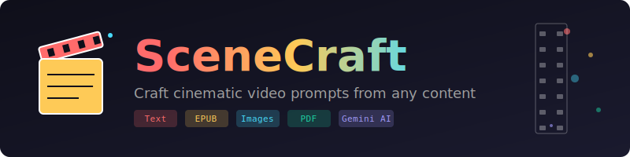

<p align="center">
  
</p>

<p align="center">
  <strong>Transform any content into cinematic video prompts</strong>
</p>

<p align="center">
  <a href="https://www.npmjs.com/package/scenecraft"></a>
  <a href="https://www.npmjs.com/package/scenecraft"></a>
  <a href="https://github.com/sunil-dhaka/scenecraft/blob/main/LICENSE"></a>
  <a href="https://nodejs.org"></a>
</p>

<p align="center">
  <a href="#installation">Installation</a> &bull;
  <a href="#quick-start">Quick Start</a> &bull;
  <a href="#features">Features</a> &bull;
  <a href="#usage">Usage</a> &bull;
  <a href="#api">API</a>
</p>

---

SceneCraft generates professional video prompts optimized for AI video generators like **Veo**, **Runway**, **Pika**, and more. Feed it text, books, or images and get back detailed, cinematic scene descriptions ready to paste.

```
   ___                    ___            __ _
  / __| __ ___ _ _  ___  / __|_ _ __ _ / _| |_
  \__ \/ _/ -_) ' \/ -_)| (__| '_/ _` |  _|  _|
  |___/\__\___|_||_\___| \___|_| \__,_|_|  \__|
```

## Features

| Feature | Description |
|---------|-------------|
| **Multi-Input** | Text, PDF, EPUB, Markdown, JPG, PNG, GIF, WebP |
| **Smart Prompts** | Camera, lighting, mood, dialogue included |
| **4 Styles** | Cinematic, Documentary, Artistic, Minimal |
| **Interactive** | Browse scenes, one-click copy to clipboard |
| **CLI Mode** | Pipe-friendly, JSON/Markdown output |
| **Gemini 3 Pro** | Powered by the latest AI model |

## Installation

```bash
npm install -g scenecraft
```

Or run directly:

```bash
npx scenecraft
```

### Requirements

- **Node.js 20+**
- **Gemini API Key** - [Get one free](https://aistudio.google.com/app/apikey)

## Quick Start

### 1. Setup (one-time)

```bash
scenecraft setup
```

### 2. Generate prompts

```bash
# Interactive mode (recommended)
scenecraft

# From a file
scenecraft generate --file story.epub

# From text
scenecraft generate --text "A dragon awakens in a crystal cave"

# From an image
scenecraft generate --file scene.jpg --scenes 5
```

### 3. Copy and use

In interactive mode, press `C` to copy any scene prompt to your clipboard.

## Usage

### Interactive Mode

Just run `scenecraft` with no arguments for the full interactive experience:

```bash
scenecraft
```

You'll be guided through:
1. Choosing input (file or text)
2. Setting scene count (1-20)
3. Picking a visual style
4. Selecting prompt elements

Then browse your scenes and copy with one keystroke.

### CLI Mode

For scripting and automation:

```bash
# Basic generation
scenecraft generate -f book.pdf -s 10

# Specific style
scenecraft generate -f story.txt --style documentary

# JSON output for processing
scenecraft generate -f input.epub --format json -o scenes.json

# Minimal prompts (no camera/lighting)
scenecraft generate -f text.md --no-camera --no-lighting

# Include character dialogue
scenecraft generate -f script.txt --dialogue
```

### Options

| Flag | Description |
|------|-------------|
| `-f, --file <path>` | Input file (txt, md, pdf, epub, jpg, png, gif, webp) |
| `-t, --text <text>` | Direct text input |
| `-s, --scenes <n>` | Number of scenes (1-20, default: 5) |
| `--style <style>` | cinematic, documentary, artistic, minimal |
| `-o, --output <path>` | Save to file |
| `--format <fmt>` | text, json, markdown |
| `-i, --interactive` | Force interactive mode |
| `--dialogue` | Include character dialogue |
| `--no-camera` | Exclude camera movements |
| `--no-lighting` | Exclude lighting descriptions |
| `--no-mood` | Exclude emotional tone |

## Visual Styles

### Cinematic (default)
Hollywood blockbuster style with dramatic angles, epic scale, and emotional depth.

### Documentary
Realistic, observational style with natural lighting and authentic moments.

### Artistic
Abstract, visually striking with bold colors, unique compositions, and metaphorical imagery.

### Minimal
Clean, focused scenes with simple backgrounds and clear subjects.

## Example Output

```
[Scene 1] The Awakening
A massive dragon's eye slowly opens in the darkness of an
ancient crystal cave. Thousands of gem fragments embedded
in the cave walls catch the first flicker of the dragon's
internal fire, creating a kaleidoscope of red and orange
reflections. Steam rises from the creature's nostrils.

Duration: 8 seconds
Camera: Extreme close-up pulling back slowly
Lighting: Internal glow from dragon, crystal reflections
Mood: Awe-inspiring, ancient power awakening
```

## Configuration

Config file: `~/.scenecraftrc`

```json
{
  "apiKey": "your-gemini-api-key",
  "model": "gemini-3-pro-preview",
  "sceneCount": 5,
  "style": "cinematic",
  "includeCamera": true,
  "includeLighting": true,
  "includeMood": true,
  "includeDialogue": false
}
```

## API

SceneCraft can also be used as a library:

```typescript
import {
  generateFromText,
  generateFromImage,
  initializeClient
} from 'scenecraft';

// Initialize with your API key
initializeClient('your-api-key');

// Generate from text
const result = await generateFromText(
  'A story about a time traveler...',
  {
    model: 'gemini-3-pro-preview',
    sceneCount: 5,
    style: 'cinematic',
    includeCamera: true,
    includeLighting: true,
    includeMood: true,
    includeDialogue: false,
  }
);

console.log(result.scenes);
```

## Keyboard Shortcuts (Interactive Mode)

| Key | Action |
|-----|--------|
| `<-` / `->` | Navigate scenes |
| `C` | Copy current prompt |
| `A` | Copy all prompts |
| `Q` | Quit |

## Use Cases

- **YouTube Shorts** - Generate scene prompts for video series
- **Film Pre-viz** - Quickly visualize book adaptations
- **Music Videos** - Transform lyrics into visual sequences
- **Ads & Promos** - Create storyboards from product descriptions
- **Game Cinematics** - Turn game narratives into cutscene prompts

## License

MIT

---

<p align="center">
  Built with <a href="https://ai.google.dev/">Google Gemini</a>
</p>
